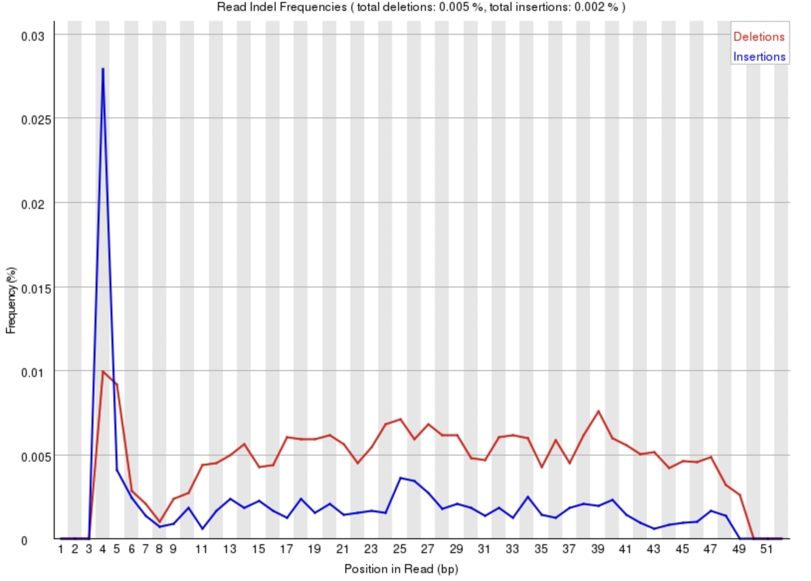
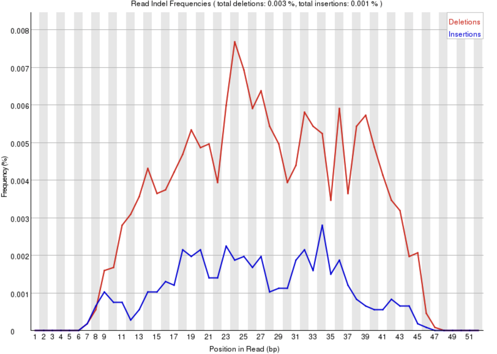
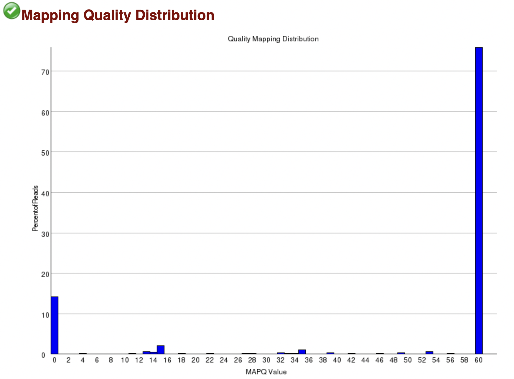
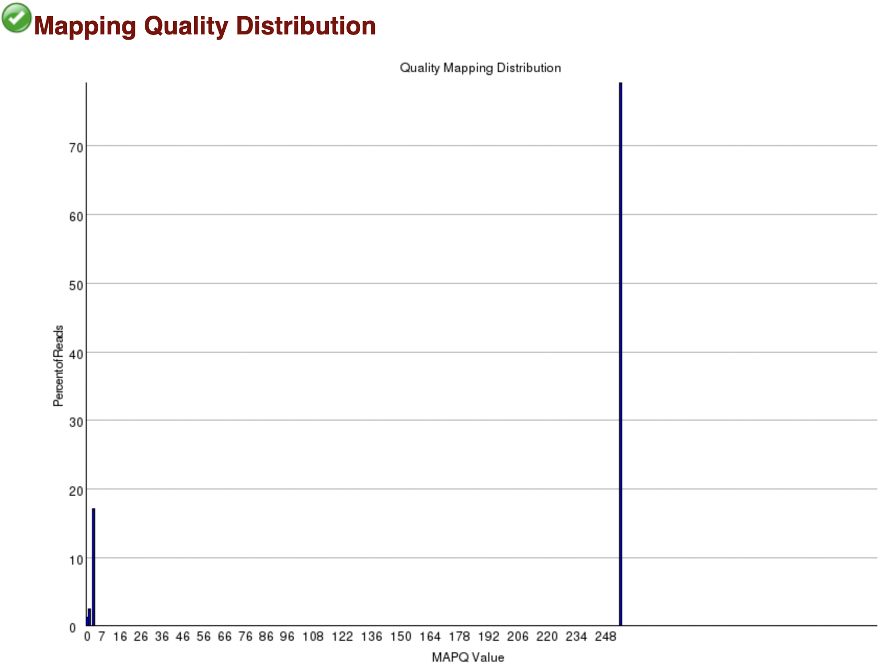

```{r setup, include=FALSE}
knitr::opts_chunk$set(echo = TRUE)
```

### Loading required packages
```{bash, eval=FALSE}
srun -n1 --pty --partition=angsd_class --mem=8G bash -i
spack load star@2.7.0e
spack load bwa@0.7.15%gcc@6.3.0
spack load samtools@1.9% gcc@6.3.0
```

##### Folder structure

The index files were copied from Luce's directory `~luce/angsd/referenceGenomes/`

```{bash, eval=FALSE}
./hw5/
├── ERR458496.fastq.gz
├── BWA
│   └── sacCer3_BWAindex
│       ├── sacCer3.amb
│       ├── sacCer3.ann
│       ├── sacCer3.bwt
│       ├── sacCer3.pac
│       └── sacCer3.sa
└── STAR
    └── sacCer3_STARindex
        ├── chrLength.txt
        ├── chrNameLength.txt
        ├── chrName.txt
        ├── chrStart.txt
        ├── exonGeTrInfo.tab
        ├── exonInfo.tab
        ├── geneInfo.tab
        ├── Genome
        ├── genomeParameters.txt
        ├── SA
        ├── SAindex
        ├── sjdbInfo.txt
        ├── sjdbList.fromGTF.out.tab
        ├── sjdbList.out.tab
        └── transcriptInfo.tab
```

# 1. Run BWA / STAR

### BWA
```{bash, eval=FALSE}
bwa mem BWA/sacCer3_BWAindex/sacCer3 ERR458496.fastq.gz > BWA/alignments/ERR458496.bwa.sam
```

##### output
The output of the alignment is saved in `BWA/alignments/ERR458496.bwa.sam`. The format of the output file is SAM, it is not sorted by the position of the mapping in the genome. Moreover the alignments are not indexes since the file is not in BAM format.


### STAR
```{bash, eval=FALSE}
STAR --runMode alignReads \
--runThreadN 1 \
--genomeDir STAR/sacCer3_STARindex/ \
--readFilesIn ERR458496.fastq.gz \
--readFilesCommand zcat \
--outFileNamePrefix STAR/alignments/ERR458493. \
--outSAMtype BAM SortedByCoordinate
```

##### output folder strcuture
```{bash, eval=FALSE}
STAR/alignments/
├── ERR458493.Aligned.sortedByCoord.out.bam
├── ERR458493.Log.final.out
├── ERR458493.Log.out
├── ERR458493.Log.progress.out
├── ERR458493.SJ.out.tab
└── ERR458493._STARtmp
    └── BAMsort
        └── 0
```
The output of the alignment is saved in `STAR/alignments/ERR458493.Aligned.sortedByCoord.out.bam`. The format of the output file is BAM, it is sorted by the position of the mapping in the genome, and the alignments are not indexes

# 2. Reads mapped to chromosome I
To retrieve the reads that are mapped to chromosome I using `samtools` the SAM file from BWA should be converted to a BAM, get sorted, then indexed. For the output from STAR, it only needs to be indexed, and a similar command can be used to retrieve the reads from chromosome I.
```{bash, eval=FALSE}
# convert SAM to BAM
samtools view -b BWA/alignments/ERR458496.bwa.sam -o BWA/alignments/ERR458496.bwa.bam 
#Sort the BAM file 
samtools sort BWA/alignments/ERR458496.bwa.bam BWA/alignments/ERR458496.bwa.sorted.bam
# Index the sorted file
samtools index BWA/alignments/ERR458496.bwa.sorted.bam 

samtools view BWA/alignments/ERR458496.bwa.sorted.bam chrI | head -n 2
```
##### output
```{bash, eval=FALSE}
ERR458496.427513	16	chrI	3782	60	51M	*	0	0	CAGTAAAGGCTTGGTAGTAACCATAATATTACCCAGGTACGAAACGCTAAG	JJJJIJJJJIJJJJJJJJJIJJJJJJJJGHBJJJJJJJHHHHHFFFFFCCB	NM:i:0	MD:Z:51	AS:i:51	XS:i:0
ERR458496.329851	16	chrI	5279	60	51M	*	0	0	ATGACCTTTGATGCGTTGGTTATGTTGAAGACAAATTGCCTCTAATCAGTT	FB9/??9B96AFC81EE@<CFFEHBCFA<<CF9FFFC:DFBBFDDB4+;;=	NM:i:0	MD:Z:51	AS:i:51	XS:i:0
```

# 3. BWA vs STAR output format

An example of mapped reads from `BWA` and `STAR`:

###### a. BWA
```{bash, eval=FALSE}
ERR458496.427513	16	chrI	3782	60	51M	*	0	0	CAGTAAAGGCTTGGTAGTAACCATAATATTACCCAGGTACGAAACGCTAAG	JJJJIJJJJIJJJJJJJJJIJJJJJJJJGHBJJJJJJJHHHHHFFFFFCCB	NM:i:0	MD:Z:51	AS:i:51	XS:i:0
```

###### b. STAR
```{bash, eval=FALSE}
ERR458496.243993	256	chrI	166	0	7M183576N44M	*	0	0	CATACCCAAGACAAGATATCAATTCAACATGCAAACCCCTTCAGAAAATAC	11=DB+=B:<DC?;:E:E:<AA:A:A9<<F<EB4?E?DDD@9DB9*009?D	NH:i:6	HI:i:6	AS:i:45	nM:i:1
```
`BWA` output the following fields: `MD`, `AS`, and `XS`. While `STAR` contains `NH`, `HI`, `AS`, and `nM` optional fields. `AS` is common to both tools, while the rest is unique to each each of the tools.

# 4. BamQC

Running bamqc tools on the resulted mappings from the tools:

#### a. BWA
```{bash, eval=FALSE}
/softlib/apps/EL7/BamQC/bin/bamqc BWA/alignments/ERR458496.bwa.sorted.bam -o BWA/bamqc
```

#### b. STAR
```{bash, eval=FALSE}
/softlib/apps/EL7/BamQC/bin/bamqc STAR/alignments/ERR458493.Aligned.sortedByCoord.out.bam -o STAR/bamqc
```

The differences between the bamqc results are:

1. **Total sequences**: BWA mapped 985637 reads, while STAR mapped 1067029 reads

2. **Indel Frequencies**: There is a sharp insertion peak at position 4 of the reads from BWA as shown in Figure 1, while STAR peaked around the middle of the reads, but the frequency is not that high as shown in Figure 2. Nevertheless both mappings passed the indel frequencies test  





3. **Additional tests**: The BamQC report for the BWA results has two additional tests titled: _SNP Frequencies_ and _SNP Frequencies by Type_, which are not present in the report for STAR results. This can be explained by the presence of `MD` option (String encoding mismatched and deleted reference bases) outputted by BWA, which absent from STAR.

# 5. Alignment Score vs Mapping Quality (MAPQ)

Alignment score is refereeing to how the read was similar to the reference. This is score is bases in the number of matches, mismatches, and gaps between the read and the reference. While MAPQ is a measure of how confident is the read comes from the region it was mapped to. For instance we can have a high alignment score and low mapping quality if the reads matches perfectly to many regions, and in some other cases we can have the opposite. This measure takes the alignment score and other information into account.

From Figure 3 and 4, we see that MAPQ from `BWA` takes value between 0 and 60, while for `STAR` the values are between 0 and 255. Both considers MAPQ = 0 if the read was mapped to many regions, MAPQ = 255 if the score is not available.





# 6. Multi-Mapping Read vs Split Read

Multi-mapping read is a read that has been found to match to a high degree different positions in the reference genome. While a split read is a read that spans different positions due to intron(s) being spliced out from the transcript.

#### Find a read that has been split in `STAR`
```{bash, eval=FALSE}
samtools view STAR/alignments/ERR458493.Aligned.sortedByCoord.out.bam | egrep '[0-9]*N' | head -n 10

>>> ERR458496.243993	256	chrI	166	0	7M183576N44M	*	0	0	CATACCCAAGACAAGATATCAATTCAACATGCAAACCCCTTCAGAAAATAC	11=DB+=B:<DC?;:E:E:<AA:A:A9<<F<EB4?E?DDD@9DB9*009?D	NH:i:6	HI:i:6	AS:i:45	nM:i:1
```

we see from `HI` that this read was mapped to 6 locations :
```{bash, eval=FALSE}
1. ERR458496.243993	256	chrI	166	0	7M183576N44M	*	0	0	CATACCCAAGACAAGATATCAATTCAACATGCAAACCCCTTCAGAAAATAC	11=DB+=B:<DC?;:E:E:<AA:A:A9<<F<EB4?E?DDD@9DB9*009?D	NH:i:6	HI:i:6	AS:i:45	nM:i:1
2. ERR458496.243993	256	chrI	96776	0	7M86966N44M	*	0	0	CATACCCAAGACAAGATATCAATTCAACATGCAAACCCCTTCAGAAAATAC	11=DB+=B:<DC?;:E:E:<AA:A:A9<<F<EB4?E?DDD@9DB9*009?D	NH:i:6	HI:i:5	AS:i:45	nM:i:1
3. ERR458496.243993	256	chrI	130504	0	7M53238N44M	*	0	0	CATACCCAAGACAAGATATCAATTCAACATGCAAACCCCTTCAGAAAATAC	11=DB+=B:<DC?;:E:E:<AA:A:A9<<F<EB4?E?DDD@9DB9*009?D	NH:i:6	HI:i:4	AS:i:45	nM:i:1
4. ERR458496.243993	256	chrI	183744	0	2S49M	*	0	0	CATACCCAAGACAAGATATCAATTCAACATGCAAACCCCTTCAGAAAATAC	11=DB+=B:<DC?;:E:E:<AA:A:A9<<F<EB4?E?DDD@9DB9*009?D	NH:i:6	HI:i:3	AS:i:46	nM:i:1
5. ERR458496.243993	256	chrVII	253616	0	12M148945N39M	*	0	0	CATACCCAAGACAAGATATCAATTCAACATGCAAACCCCTTCAGAAAATAC	11=DB+=B:<DC?;:E:E:<AA:A:A9<<F<EB4?E?DDD@9DB9*009?D	NH:i:6	HI:i:2	AS:i:45	nM:i:1
6. ERR458496.243993	0	chrVII	402563	0	2S49M	*	0	0	CATACCCAAGACAAGATATCAATTCAACATGCAAACCCCTTCAGAAAATAC	11=DB+=B:<DC?;:E:E:<AA:A:A9<<F<EB4?E?DDD@9DB9*009?D	NH:i:6	HI:i:1	AS:i:46	nM:i:1
```

#### BAW handling of the read

```{bash, eval=FALSE}
samtools view BWA/alignments/ERR458496.bwa.sorted.bam | egrep 'ERR458496.243993'

>>> ERR458496.243993    0	chrI	183742	0	51M	*	0	0	CATACCCAAGACAAGATATCAATTCAACATGCAAACCCCTTCAGAAAATAC	11=DB+=B:<DC?;:E:E:<AA:A:A9<<F<EB4?E?DDD@9DB9*009?D	NM:i:2	MD:Z:1T3A4AS:i:45	XS:i:45	XA:Z:chrVII,+402561,51M,2;
```

We see that BWA outputted a single mapping in ChrI, in addition to alternative mapping to ChrVII specified by the `XA` field. BWA chose the mapping with highest alignment score.

# 7. Filter Unmapped reads

To filter out the unmapped reads, we should filter the read by the bit-wise flags. Specifically we should exclude the reads whose 3rd bit is zero. 

```{bash, eval=FALSE}
samtools view -F 0x4 BWA/alignments/ERR458496.bwa.sorted.bam -o BWA/alignments/ERR458496.bwa.filtered.bam
```


