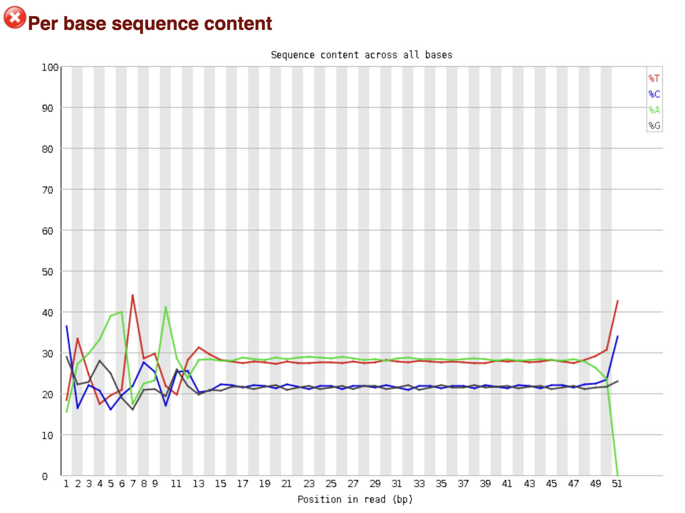
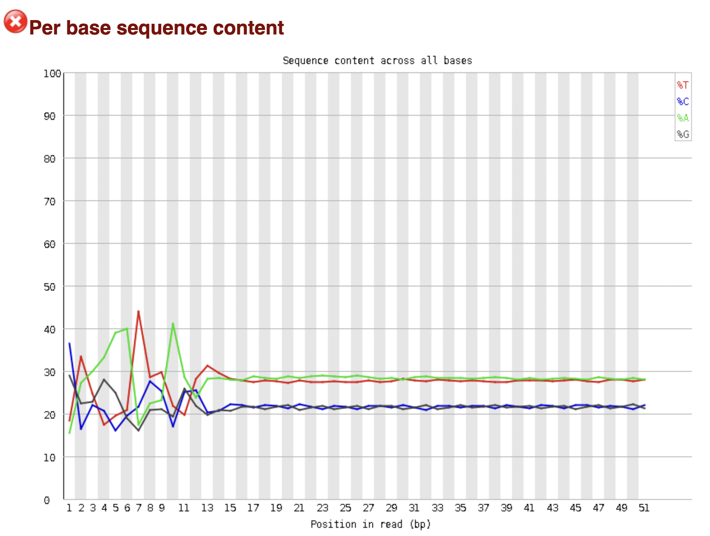
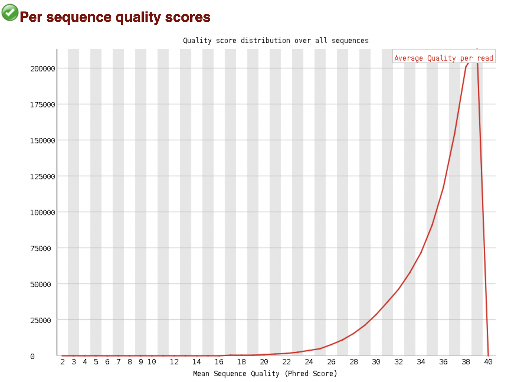
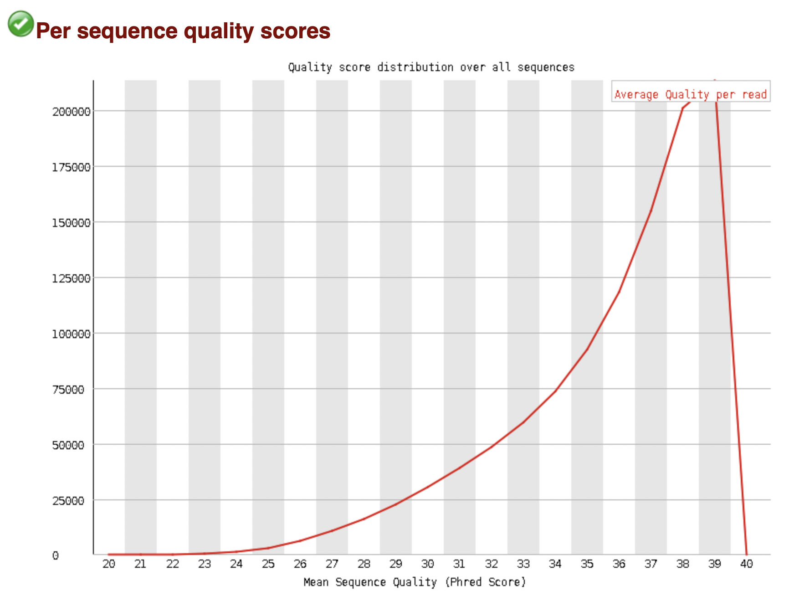
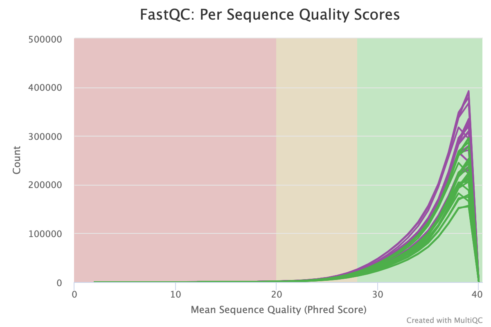
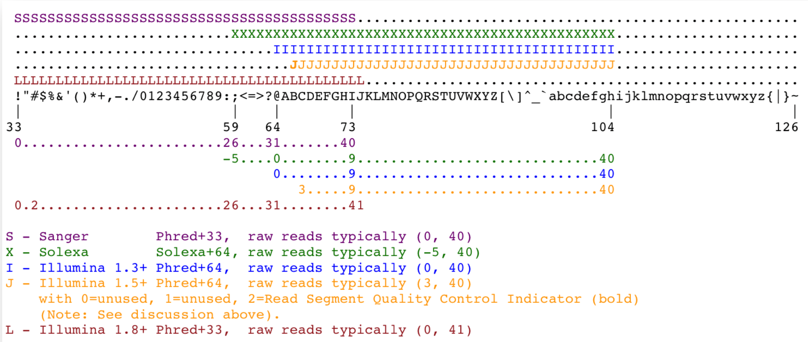

```{r setup, include=FALSE}
knitr::opts_chunk$set(echo = TRUE)
```

## 1. Downlaod Data

Extract RunAccession codes for the first three WT and SNF2 biological replicates. 
Use the codes to obtain the URL links to the corresponding fastq files, and save the links to a file
Iterate through the links and download the fastq file to 'fastq' folder
```{bash, eval=FALSE}
#!/bin/bash
allowedERR=$(cat ERP004763_sample_mapping.txt | egrep $'[WT SNF2]\t[1 2 3]$' | cut -d $'\t' -f 1)
for ERR in $allowedERR; do
    cat filereport_read_run_PRJEB5348_tsv.txt | egrep $ERR | echo 'ftp://'$(cut -d $'\t' -f 7) >>     urls_to_downlaod_2.txt
done

echo 'There are :'$(cat urls_to_downlaod_2.txt | wc -l) 'files'

echo 'Start Downloading....'
cat urls_to_downlaod_2.txt | while read line; do 
  wget -N $url -P fastq/
done
```

## 2. FastQC

### 1. Run fastqc on all the files

run fastqc tool on the files one by one and save the results to 'fastqc' folder
```{bash, eval=FALSE}
for file in fastq/*; do 
  fastqc $file --extract -o fastqc/
done
```


### 2. Trim ERR458493_WT sample

run TrimGalore tool on ERR458493_WT sample and save the results to 'fastq_trimmed' folder
```{bash, eval=FALSE}
trim_galore --illumina fastq/ERR458493_WT.fastq.gz --stringency 5 -o fastq_trimmed/ 
```

### 3. Run fastqc on the trimmed file
```{bash, eval=FALSE}
fastqc fastq_trimmed/ERR458493_WT_trimmed.fq.gz --extract -o fastq_trimmed/ 
```

## 3. Changes after TrimGalore
First I run TrimGalore with the default parameters, and after inspecting the results I noticed that the content of the base 'A' at last position was 0% as shown in Figure 1, and that's due to the default value of the stringency (stringency=1). I decided to use a more realistic value, thus I set stringency parameter to 5. this way if a matching is found, the probability that this sequence is not an adapter is <0.1%. Figure 2 shows the Per base sequence content after the trimming. Per base sequence content before (Figure 3) and after using TrimGalore didn't change, because overall the number of sequences trimmed or removed is negligible that the per base sequence content is not affected








One detail that has changed is the per sequence quality scores. 'Trimgalore' has a preprocessing step where it filters out the sequences with poor quality scores. Figures 4 and 5 shows the per sequence quality scores before and after using 'Trimgalore', respectively. We can see that the range of scores in Figure 5 starts at 20, while in Figure 4 the range starts at 2, which indicates that low quality sequences were removed.





## 4. MultiQC

### 1. Renaming the file for MultiQC
The naming of the files is critical to down stream analysis, this was not taken into consideration up stream, thus I have to rename the files to include the condition (WT or SNF2) in the files name
```{bash, eval=FALSE}

for file in fastq/*; do 
  fileName=$(basename $file | cut -d '.' -f 1)
  egrep $fileName ERP004763_sample_mapping.txt | mv $file  fastq/${fileName}_$(cut -d $'\t' -f 3).fastq.gz
done
```


### 2. Run MultiQC

```{bash, eval=FALSE}
multiqc fastqc/

```
##### Result
Figure 6 shows the per sequence quality scores for the 42 experiments, where the WT condition is highlighted with green and the SNF2 with purple color. We expect that the per sequence quality scores should be similar between the experiments. We see a clear separation between the conditions, where the SNF2 scores are consistently higher than the WT condition for unclear reason.



## 5. Can the thecnical replicate files be combined?
Based on the QC results, it is possible to combine any of the fastq files given that they are technical replicates. Looking at the results grouped by technical replicates, we see a similar pattern which suggest that there is no experiment that can can skew the down stream analysis if combined, but it would be better if the files where processed first (trimming) before combination. 

## 6. Combine Fastq file
the command used to combine files is `cat`. to combine WT files for example we can use the following command:
```{bash, eval=FALSE}
cat fastq/*_WT.fastq.gz > fastq/WT.fastq.gz
```

## 7. Determine the version of the Sanger quality score

To determine the version of the Sanger quality score, we obtain the ASCII codes for the scores from the first million reads (taking more sequences will increase the certainty of the results), and look at the lowest ASCII code value, if the value is less than 59 this indicates that the version is 'Sanger standard', if the value is less than 64 this indicates the version is 'Solexa/early Illumina', otherwise it's 'Illumina 1.3+ standard'. It may be difficult to distinguish between 'Solexa/early Illumina' and 'Illumina 1.3+ standard', for that we can plot the distribution of the ASCII codes values of the reads and look at the mean and compare it to a mean of experiment from known scoring standard. Increase in the mean corresponds to going down the list of Cavas version shown in Figure 7.




